# DataScope User Manual

## Introduction
DataScope is a web-based analytics platform that allows users to upload, connect, and explore data sources through natural-language queries and automated visualizations.  
It combines Artificial Intelligence, automation, and user-friendly design to transform raw data into actionable insights.  

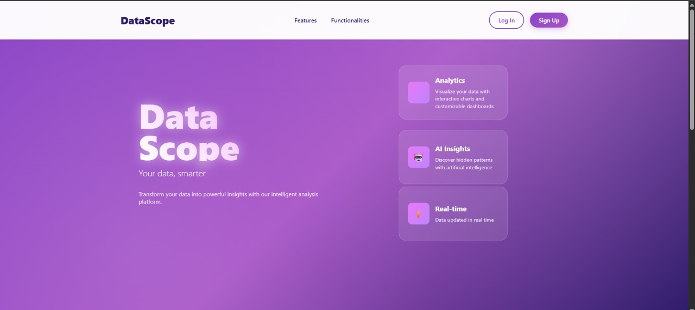  
*Figure 0. Landing page introducing the DataScope platform.*

*(Covered Requirements: ER1, ER2, ER3)*

---

## 1. User Registration
New users can register by filling out the **Create Account** form with a username, email address, and password.  
Passwords must meet complexity requirements and be confirmed before submission.

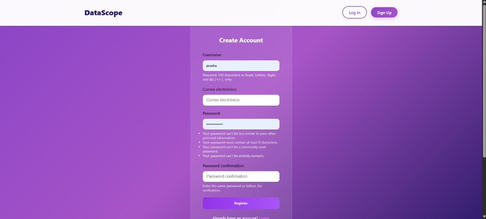  
*Figure 1. User registration form with fields for name, email, and password.*

*(Covered Requirements: FR1)*

---

## 2. Logging In
Registered users can log in by entering their credentials on the **Login** page.  
Once authenticated, users gain access to their personal dashboard and saved data sources.

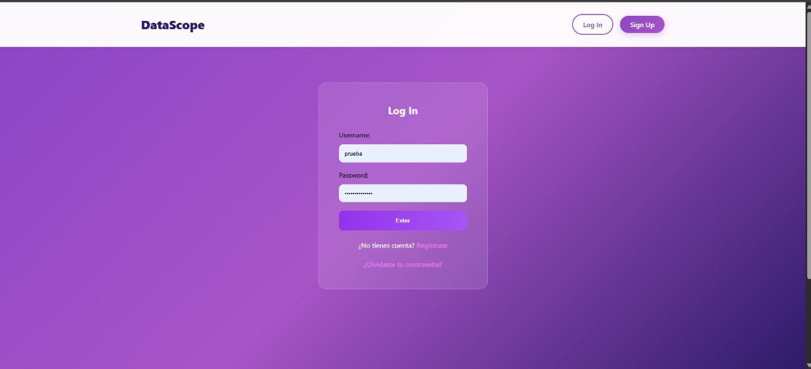  
*Figure 2. Login screen where registered users access their accounts.*

*(Covered Requirements: FR2, FR5, FR20)*

---

## 3. Password Recovery
If a user forgets their password, they can request a reset link by providing their registered email address.  
A secure recovery email will be sent automatically.

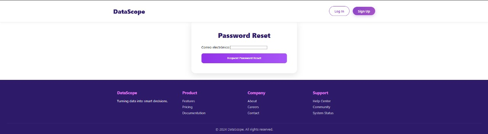  
*Figure 3. Password recovery page with email verification.*

*(Covered Requirements: FR3)*

---

## 4. Dashboard Overview
After logging in, users are redirected to the main **Dashboard**, which provides access to:
- File upload and analysis  
- Database connections  
- Chat interface for AI queries  
- History of previous analyses  
- Favorite questions  

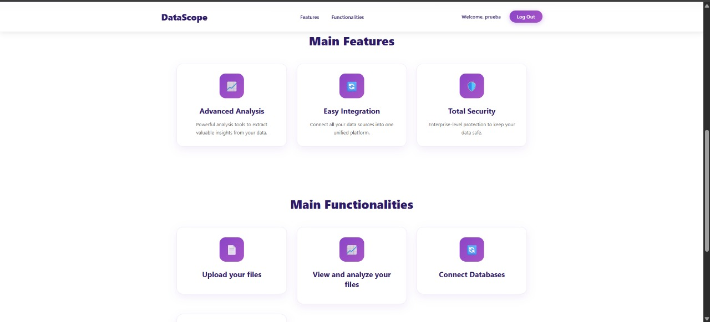  
*Figure 4. Main dashboard showing navigation options and quick access features.*

*(Covered Requirements: FR5, FR19, FR23, FR22)*

---

## 5. Uploading Data Files
Users can upload datasets in `.csv` or `.xlsx` format.  
Once uploaded, DataScope automatically validates the structure, previews the content, and calculates basic metrics.

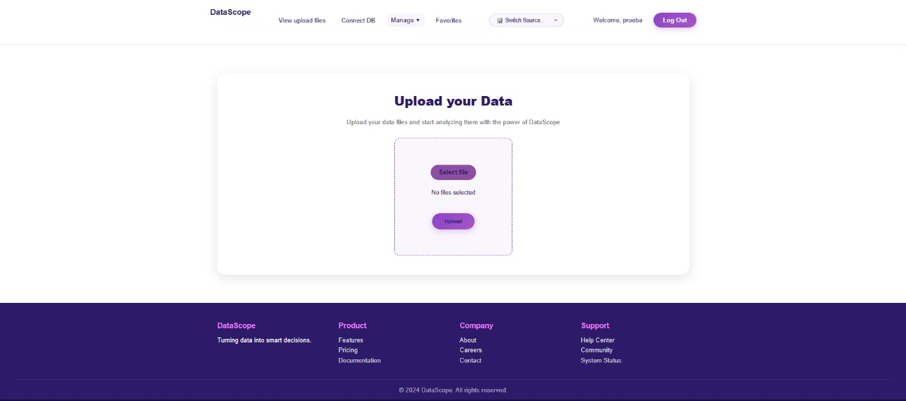  
*Figure 5. File upload interface for importing CSV or Excel datasets.*

*(Covered Requirements: FR6, FR8, FR17)*

---

## 6. Viewing Uploaded Files
All uploaded files appear under the **My Files** section.  
Users can select a dataset and choose **“View and Make Analysis”** to begin exploration.

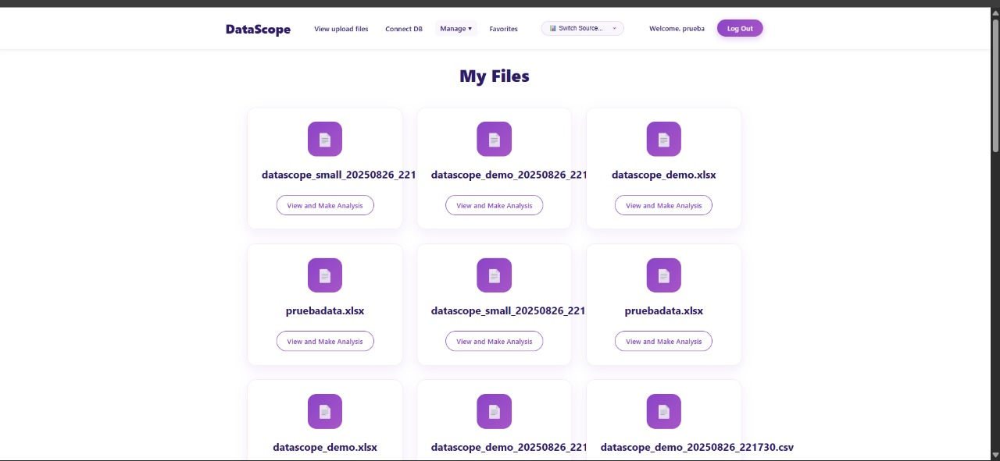  
*Figure 6. “My Files” section displaying uploaded datasets ready for analysis.*

*(Covered Requirements: FR6, FR9, FR12)*

---

## 7. Connecting External Databases
DataScope allows connecting to external databases such as PostgreSQL, MySQL, or SQLite.  
Users must provide the host, port, database name, username, and password.  
A **Test & Save** button verifies the connection before saving.

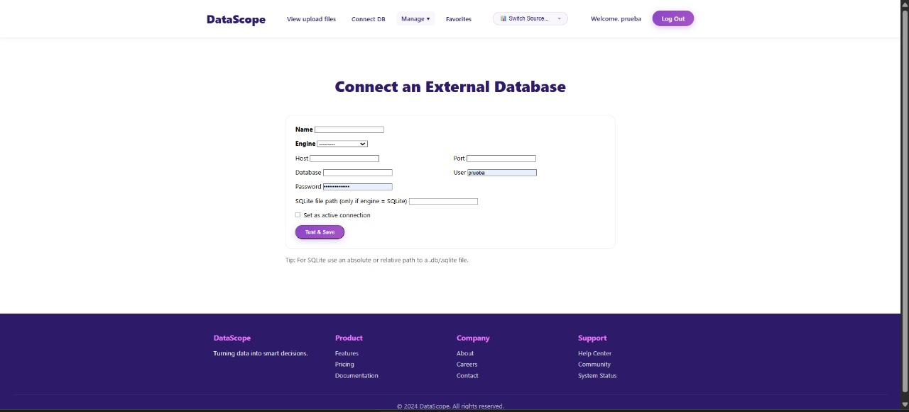  
*Figure 7a. Database connection form supporting PostgreSQL, MySQL, and SQLite.*

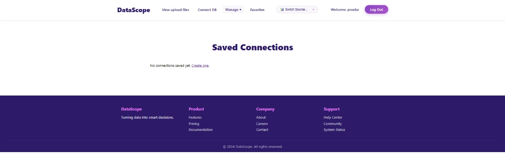  
*Figure 7b. View of saved external database connections.*

*(Covered Requirements: FR7, FR23)*

---

## 8. Managing Data Sources
The **Manage → Data Sources** menu allows switching between uploaded files or database connections.  
Active sources are highlighted and can be viewed or analyzed instantly.

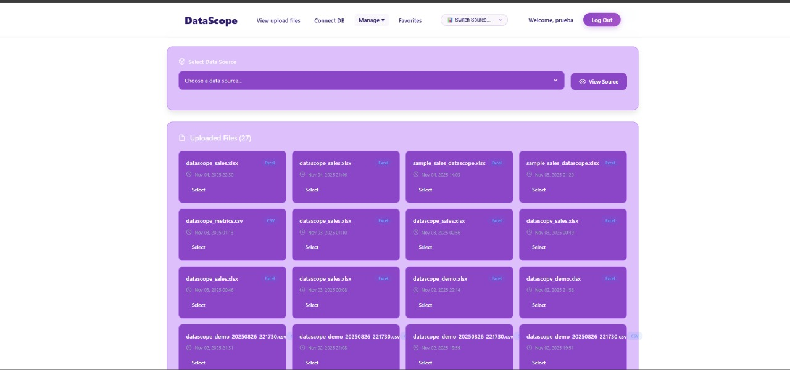  
*Figure 8a. Selecting a data source from uploaded files.*

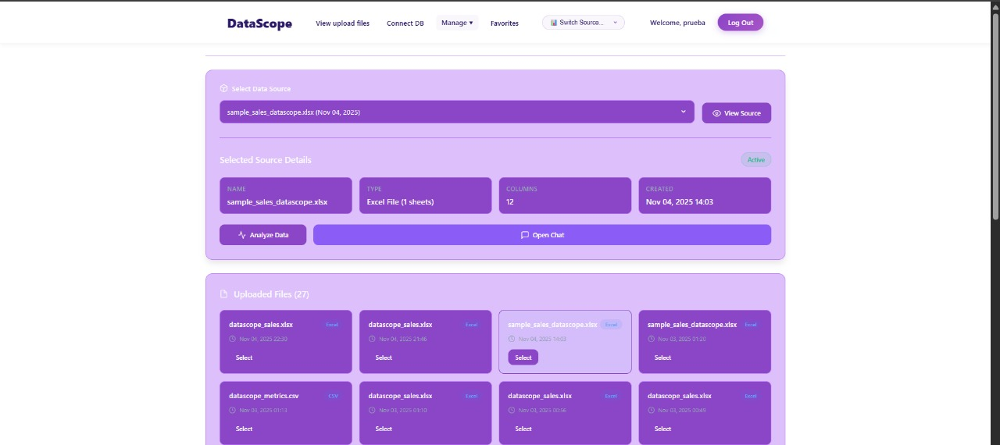  
*Figure 8b. Active data source displayed as selected.*

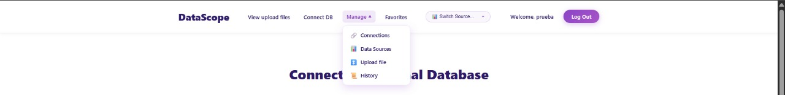  
*Figure 8c. Interface for switching between active sources.*

*(Covered Requirements: FR23)*

---

## 9. AI-Powered Questioning
In the **Chat with DataScope** interface, users can type questions in natural language (e.g., “What were the total sales per store?”).  
DataScope interprets the query, translates it into SQL, executes it, and returns the result in text or table form.

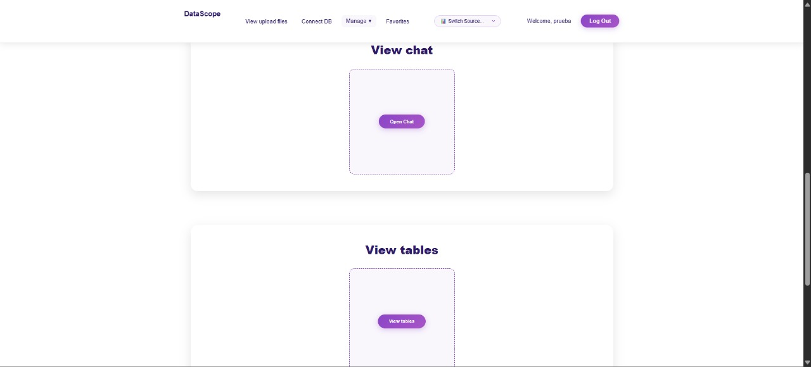  
*Figure 9a. Conversational AI chat for natural-language data queries.*

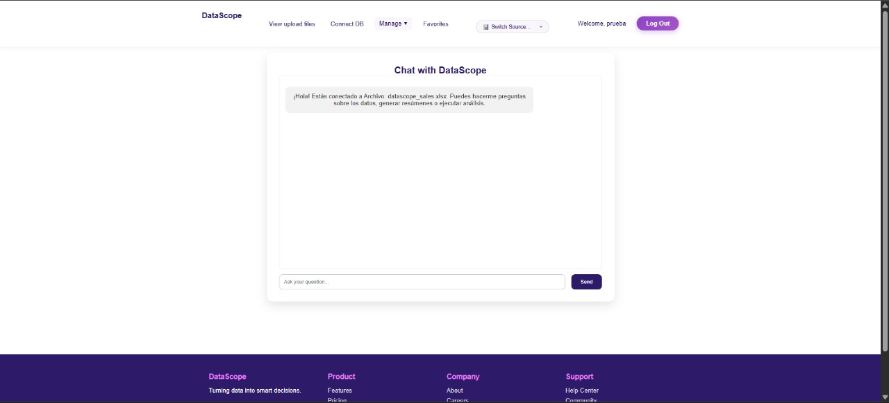  
*Figure 9b. Active chat connected to a selected data source.*

*(Covered Requirements: FR10, FR11, FR12, FR13, FR24, FR29)*

---

## 10. Visualization
DataScope automatically generates charts for numeric or temporal data.  
Users can also manually choose the type of chart (bar, line, pie, etc.) and view trends visually.

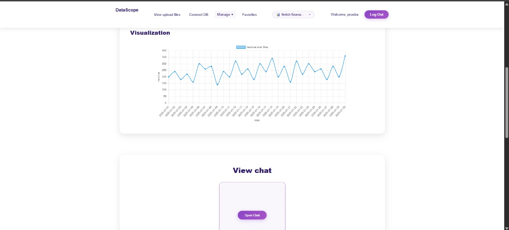  
*Figure 10. Automatically generated chart visualization of data insights.*

*(Covered Requirements: FR15, FR16, FR17)*

---

## 11. Viewing Tables and Metrics
For each dataset, users can preview a formatted table and summary metrics such as mean, median, and max values.

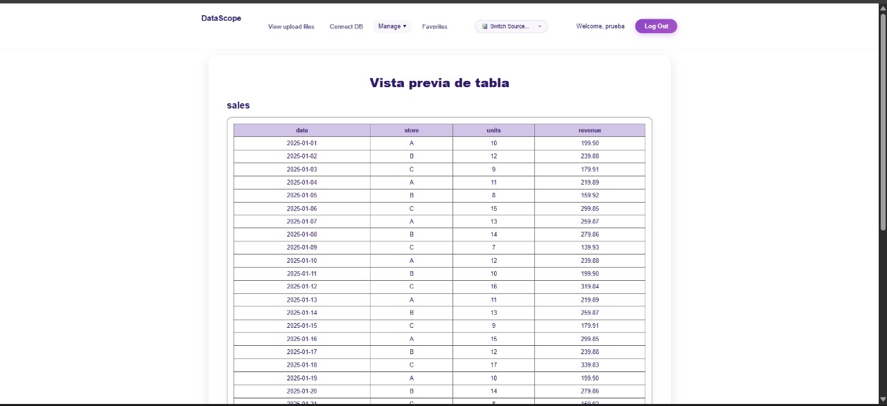  
*Figure 11a. Tabular data preview with basic statistics.*

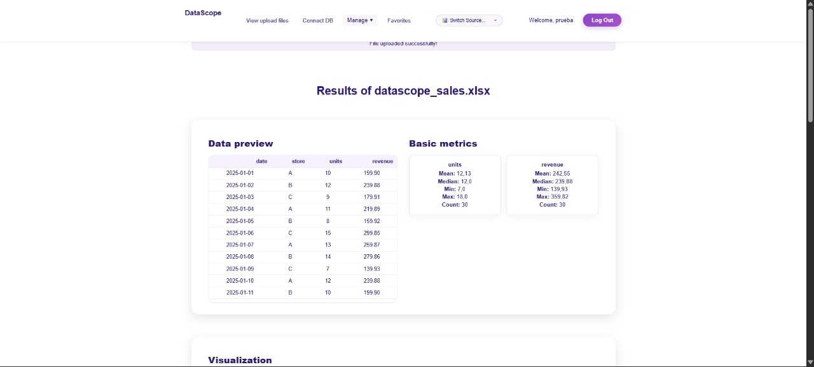  
*Figure 11b. Visualization of dataset metrics and descriptive statistics.*

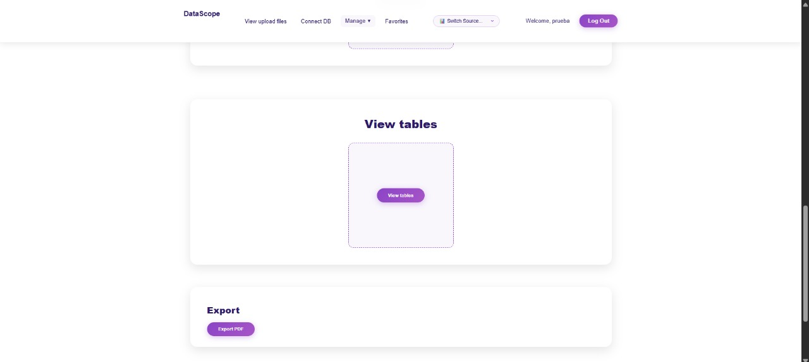  
*Figure 11c. Interface for browsing available tables within a data source.*

*(Covered Requirements: FR8, FR17)*

---

## 12. Saving Favorite Queries
Users can mark specific questions as favorites for quick reuse.  
Saved questions are accessible in the **Favorites** section.

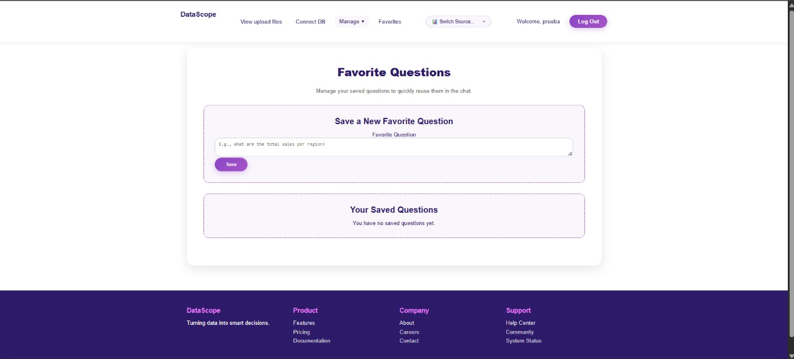  
*Figure 12. Favorite questions page showing saved queries.*

*(Covered Requirements: FR19)*

---

## 13. Query History
Every user query and its result are logged in the **History** section, along with timestamps for easy reference.  
This enables users to track their analyses and revisit past interactions.

*(Covered Requirements: FR14, FR21)*

---

## 14. Exporting Results
Users can export their analysis, charts, and metrics as a formatted **PDF report** by clicking **Export PDF**.  

*(Covered Requirements: FR18)*

---

## 15. Security and Access Control
Each user’s data, queries, and database connections are isolated to ensure privacy.  
Access controls enforce role-based restrictions where applicable.  

*(Covered Requirements: FR20, ER2)*

---

## 16. Responsive Design
DataScope’s interface adapts to multiple devices and resolutions.  
All functionalities remain accessible on desktops, tablets, and mobile browsers.  

*(Covered Requirements: FR22, ER3)*

---

## 17. Troubleshooting and Support
If the system encounters an invalid file or malformed query, descriptive error messages guide the user to resolve the issue.  
A **Help Center** section provides contact and documentation links for additional assistance.  

*(Covered Requirements: FR13, ER3)*

---

## 18. Technical Notes
- **AI Models (LLM Selection):** DataScope supports different Large Language Models for query interpretation and precision validation.  
- **Logging:** All activity is recorded securely for audit and system monitoring purposes.  

*(Covered Requirements: ER1, FR29)*

---

## Conclusion
DataScope empowers users to interact with data intelligently, combining automated analytics, visualization, and conversational AI in a secure and intuitive environment.  
It is designed for professionals seeking quick insights without technical barriers.